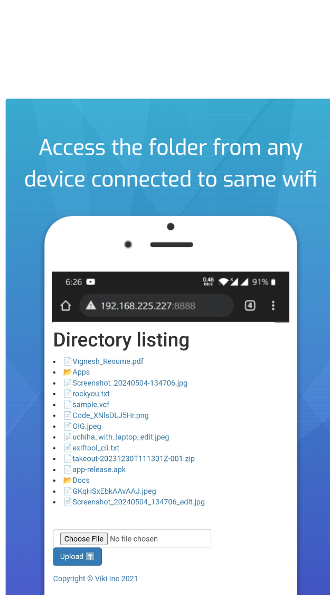

# ServeIt

## 💻Getting Started
One app to serve them all

ServeIt uses http protocol as a way to share (both send & receive) files between multiple devices.

Any device with a web browser connected to the same LAN network can navigate to the url exposed by ServeIt app, to share files inside the network.

## 🥽Features
- Send files to multiple devices connected to the same LAN network
- Receive files from multiple devices connected to the same LAN network
- Cross platform file sharing across Android, Windows, Linux, MacOS, iOS basically any OS which supports web browser & http protocol
- Start a single webpage server from Android (Serves index.html from the exposed root direcory as a webpage under LAN, For more info check [#10](https://github.com/many-fac3d-g0d/ServeIt/pull/10))
## 📸Screenshots

## 🔐Authentication

Currently there is no authentication from app end. The app assumes anyone connected to the same wifi network as the user is already authenticated.

⚠ Do not use the app in a public wifi.

## 💰Donate

Liked this project, want to contribute ? Consider donating

## 📄License

This project and its contents are open source under the [GNU GPLv3](https://choosealicense.com/licenses/gpl-3.0/)
